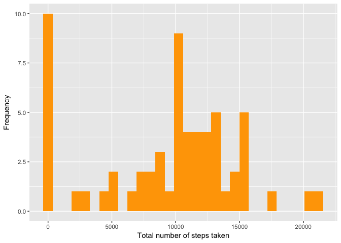

1st Assignment of Reproducible Research Course
================
Nicolas Corneau-Tremblay
7/18/2017

Preamble
--------

This document is my submission for the first assignment of Coursera - Reproducible Research course. To complete this asignment, I use the following libraries :

``` r
library(readr)
library(dplyr)
library(lubridate)
library(ggplot2)
```

1 : Code for reading in the dataset and/or processing the data
--------------------------------------------------------------

The data for this assignment is from a personal activity monitoring device and is available on Coursera website.

``` r
activity <- read_csv("activity.csv")
head(activity)
```

    ## # A tibble: 6 x 3
    ##   steps       date interval
    ##   <int>     <date>    <int>
    ## 1    NA 2012-10-01        0
    ## 2    NA 2012-10-01        5
    ## 3    NA 2012-10-01       10
    ## 4    NA 2012-10-01       15
    ## 5    NA 2012-10-01       20
    ## 6    NA 2012-10-01       25

2 : Histogram of the total number of steps taken each day
---------------------------------------------------------

Here is the histogram representing the total number of steps taken each day calculated on the entire sample. First, I create a new dataframe containing the total, the mean and the median number of steps taken for each day of the week. I then use this new dataframe to plot a histogram.

``` r
day <- activity %>%
    group_by(date) %>%
    summarize(n.steps = sum(steps, na.rm = TRUE),
              mn.steps = mean(steps, na.rm = TRUE),
              md.steps = median(steps, na.rm = TRUE))


ggplot(day) +
    geom_histogram(aes(n.steps), fill = "orange") +
    xlab("Total number of steps taken") +
    ylab("Frequency")
```



3 : Mean and median number of steps taken each day
--------------------------------------------------

The **mean number of steps taken per day** is 9,354.23 and the **median number of steps taken per day** is 10,395.

4 : Time series plot of the average number of steps taken
---------------------------------------------------------

``` r
ggplot(day) +
    geom_line(aes(date, mn.steps))
```


5 : The 5-minute interval that, on average, contains the maximum number of steps
--------------------------------------------------------------------------------

``` r
inter <- activity %>%
    group_by(interval) %>%
    summarize(mn.steps = mean(steps, na.rm = TRUE)) %>%
    arrange(desc(mn.steps))
```

The interval that contains, on average, the maximum number of steps is the 835th one of the day.

6 : Code to describe and show a strategy for imputing missing data
------------------------------------------------------------------

For the sake of this project, when the number of steps for an interval is missing, I impute the average number of steps taken in each interval of that day. If the entire day is missing, I then impute the whole sample mean for the interval. There is currently 2,304 missing values in the variable *steps*. The following code imputes the corresponding values :

``` r
imputed <- activity %>%
    arrange(date, interval) %>%
    group_by(date) %>%
    mutate(day.mean = mean(steps, na.rm = TRUE)) %>%
    ungroup() %>%
    mutate(all.mean = mean(steps, na.rm = TRUE))

imputed <- imputed %>%
    mutate(imp.val = as.integer(round(coalesce(day.mean, all.mean)))) %>%
    mutate(steps = coalesce(steps, imp.val))
```

After imputation, there is 0 missing value left in the new data set.

7 : Histogram of the total number of steps taken each day after missing values are imputed
------------------------------------------------------------------------------------------

``` r
day.imp <- imputed %>%
    group_by(date) %>%
    summarize(n.steps = sum(steps, na.rm = TRUE),
              mn.steps = mean(steps, na.rm = TRUE),
              md.steps = median(steps, na.rm = TRUE))


ggplot(day.imp) +
    geom_histogram(aes(n.steps), fill = "orange") +
    xlab("Total number of steps taken (with imputation)") +
    ylab("Frequency")
```


8 : Panel plot comparing the average number of steps taken per 5-minute interval across weekdays and weekends
-------------------------------------------------------------------------------------------------------------

``` r
week.day <- imputed %>%
    group_by(day = wday(date, label = TRUE, abbr = TRUE), interval) %>%
    summarize(mn.steps = mean(steps, na.rm = TRUE))

ggplot(week.day) +
    geom_smooth(aes(interval, mn.steps, group = day, color = day), se = FALSE) +
    labs(x = "5-minute interval", 
         y = "Average number of steps",
         color = "Days of the week")
```


9 : All of the R code needed to reproduce the results (numbers, plots, etc.) in the report
------------------------------------------------------------------------------------------

The R code is available throughout the document.
